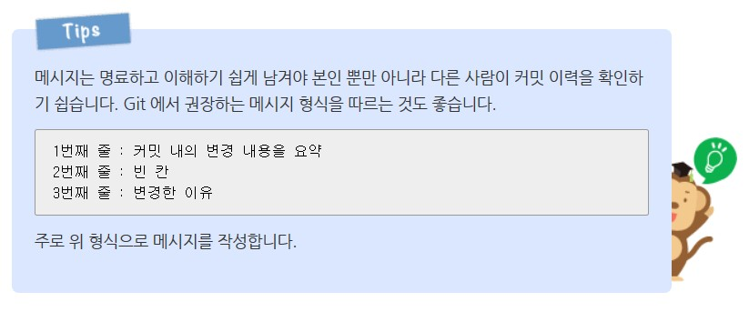

# Git과 GitHub의 사용법
2020.01.23 최초 생성, 작성자 : **김진모**
#
## Git과 GitHub가 무엇일까?
Git은 VCS(Version Control System)의 일종으로, 프로젝트의 변경을 관리하는 소프트웨어이다.  

프로젝트를 진행하면 다양한 변경사항들이 생성된다. 이때 하나의 코드에 다수의 수정사항이 생길 경우나
코드의 문제 발생 부분을 찾아야 할 일이 생길 수도 있을 것이다. Git은 이러한 경우들에 대해 모든 변경사항들의 스냅샷을
저장하여 쉽게 변경 사항들을 합치거나 고칠 수 있다. 
하지만, 이러한 Git은 CLI(Command Line Interface)에서 사용하기 때문에처음 접하는 사용자의 경우 접근이 어렵다는 단점이 있다.  

이러한 단점을 해결하기 위해 만들어진 서비스 중 하나가 바로 GitHub이다. GitHub는 GUI(Graphic User Interface)를 기반으로
Git을 편리하게 이용할 수 있도록 한 서비스이다. 또한 GitHub을 이용하면 웹에서 프로젝트를 관리하고, 평가 및 토론 등의
소셜 네트워크 기능을 사용할 수 있다.

Git의 설치 방법 및 GitHub의 사용 방법은 다음 링크들을 참고하자.  

>https://coding-factory.tistory.com/245
>https://tagilog.tistory.com/377
#
## Git에서 쓰이는 주요 용어 및 명령어
### 주요 용어
#### 로컬 깃 저장소(Local Git Repository) 및 원격 깃 저장소(Remote Git Repository)
**원격 저장소** : 파일이 원격 저장소 전용 서버에서 관리되며 여러 사람이 함께 공유하기 위한 저장소이다.  

**로컬 저장소** : 내 PC에 파일이 저장되는 개인 전용 저장소이다.  

평소에는 사용자의 로컬 저장소에서 파일을 작성한 후, 이 파일을 원격 저장소에 업로드한다. 또한, 원격 저장소에서 로컬 저장소로
파일을 다운받을 수도 있다.

#### 커밋(commit)과 푸시(push)
**커밋** : 파일을 저장하거나 변경 내용을 저장소에 저장하는 작업이다.  

**푸시** : 파일을 저장하거나 변경 내용을 *원격 저장소*에 저장하는 작업이다.  

커밋은 파일의 이력을 남기는 중요한 작업이다. 그렇기 때문에 커밋을 할 때 커밋 메시지는 필수적으로 작성해야 한다. 
커밋 메시지는 적절한 형식을 지켜 작성해야 한다. 다음 이미지와 링크를 참조하자.

>[좋은 git 커밋 메시지를 작성하기 위한 7가지 약속](https://meetup.toast.com/posts/106)

#### 브랜치(Branch)
브랜치는 코드를 분기하여 독립적인 개발을 하는 것을 말한다. Git이 다른 VCS들과 가장 차별화되는 점은 아주 가벼운 브랜치를 
가지고 있다는 것이다. 그렇기에 Git은 브랜치를 만들어 작업하고, 이 브랜치들을 병합하는 식으로 작업이 이루어진다.
자세한 내용은 아래 링크에서 3.1 ~ 3.7을 참조하자. 브랜치의 워크플로는 주로 master 브랜치에 안정화된 버전을 넣고, hotfix나 개발 단계의
기능을 따로 브랜치로 분리하여 개발하는 흐름을 따른다. 즉, 브랜치를 하나의 '실험실'과 같은 개념으로 보게된다.  
>[Git 브랜치 - 브랜치란 무엇인가](https://git-scm.com/book/ko/v2/Git-%EB%B8%8C%EB%9E%9C%EC%B9%98-%EB%B8%8C%EB%9E%9C%EC%B9%98%EB%9E%80-%EB%AC%B4%EC%97%87%EC%9D%B8%EA%B0%80)

#### HEAD
현재 브랜치를 가리키는 포인터이다. 

### 명령어
#### git init
깃 저장소를 초기화한다. 저장소나 디렉토리 안에서 이 명령을 실행하기 전까지는 그냥 일반 폴더이다. 
이것을 입력한 후에야 추가적인 깃 명령어들을 줄 수 있다. 

#### git config
“configure”의 준말으로, 처음에 깃을 설정할 때 유용하다. 사용자의 이름과 이메일을 설정할 때 사용하며, 이때는 아래와 같은
형식으로 사용한다. --global 옵션은 전역에 적용되는 사용자 정보를 설정할 때 사용한다.  
> git config --global user.name “Your name”             //사용자 이름  
> git config --global user.email “Your email address”   //사용자 이메일  
> git config --global --list                            //전역 설정 정보 조회

#### git help
명령어를 잊어버렸을 때 커맨드 라인에 이걸 타이핑하면 21개의 가장 많이 사용하는 깃 명령어들이 나타난다.
좀 더 자세하게 “git help init”이나 다른 용어를 타이핑하여 특정 깃 명령어를 사용하고 설정하는 법을 이해할 수도 있다.

#### git status
저장소 상태를 체크한다. 어떤 파일이 저장소 안에 있는지, 커밋이 필요한 변경사항이 있는지, 
현재 저장소의 어떤 브랜치에서 작업하고 있는지 등을 볼 수 있다.

#### git add
이 명령이 저장소에 새 파일들을 추가하진 **않는다**. 
대신, 깃이 새 파일들을 지켜보게 한다. 파일을 추가하면, 깃의 저장소 스냅샷에 포함된다.

#### git commit
깃의 가장 중요한 명령어이다. 어떤 변경사항이라도 만든 후, 저장소의 “스냅샷”을 찍기 위해 이것을 입력한다. 
보통 “git commit -m “Message hear.” 형식으로 사용한다. -m은 명령어의 그 다음 부분을 메시지로 읽어야 한다는 것을 말한다.
git commit만 사용한 후 vim과 같은 에디터를 이용하여 커밋 메시지를 작성할 수도 있다.

#### git branch 
새로운 브랜치를 만들기 위한 명령어이다. 단, 현재 브랜치를 이동시키지는 않는다. 아래와 같이 사용한다.
> git branch "Branch Name"  //브랜치 생성  
> git branch -r             //원격 브랜치 목록 보기  
> git branch -a             //로컬 브랜치 목록 보기  
> git branch -m "Branch Name" "New Branch Name" //브랜치 이름 변경  
> git branch -d "Branch Name"   //브랜치 삭제
> git branch -D "Branch Name"   //병합하지 않은 브랜치 삭제

#### git checkout 
다른 파일, 커밋 또는 브랜치로 이동하기 위한 명령어이다. 아래의 예처럼 사용 가능하다.
> git checkout "Branch Name"                    //브랜치 선택하기
> git checkout -t remote_path/"Branch Name"     //원격 브랜치 선택하기
> git checkout "Commit Hash Num"                //커밋 선택하기
> git checkout -b "Branch Name"                 //브랜치를 생성하고 선택

#### git merge
브랜치에서 작업을 끝내고, 모든 협업자가 볼 수 있는 master 브랜치로 병합할 수 있다. 
> git merge "Branch Name"   //브랜치를 master에 병합. 이때 HEAD가 master 브랜치에 있어야 한다.

#### git push
로컬에서 작업한 커밋을 원격 저장소에 올리기 위해 사용하는 명령어이다. 어떤 작업을 끝낼 때 push를 하는 것을 습관화하여야
한다.

#### git pull
원격 저장소의 최신 버전을 로컬로 가져오기 위해 사용하는 명령어이다. push와 마찬가지로, 추후 병합 시의 무수한 충돌을 
방지하기 위해 작업 전에 pull을 하는 것을 습관화하여야 한다.
#
## PyCharm에서 Git을 사용하는 방법
커맨드 라인에서 Git을 사용하는 것도 익숙해지면 편리하긴 하지만, PyCharm에서는 편리하게 그래픽 인터페이스를 통해 Git을 
사용할 수 있도록 돕고 있다. 아래 링크를 참조하자.
> [파이참(PyCharm)과 깃허브(GitHub) 연동하기](https://lsjsj92.tistory.com/364)
#
## 그 이외의 그래픽 기반 Git 사용 프로그램
Sourcetree, GitHub Desktop과 같은 프로그램을 사용하면 브랜치의 흐름 등을 편리하게 눈으로 확인할 수 있다.

--------------------
### 참고 문서
[누구나 쉽게 입문할 수 있는 Git 입문](https://backlog.com/git-tutorial/kr/intro/intro1_1.html)  
[git - 간편 안내서](https://rogerdudler.github.io/git-guide/index.ko.html)  
[완전 초보를 위한 깃허브](https://nolboo.kim/blog/2013/10/06/github-for-beginner/)  
[파이참(PyCharm)과 깃허브(GitHub) 연동하기](https://lsjsj92.tistory.com/364)  
[좋은 git 커밋 메시지를 작성하기 위한 7가지 약속](https://meetup.toast.com/posts/106)  
[Git 브랜치 - 브랜치란 무엇인가](https://git-scm.com/book/ko/v2/Git-%EB%B8%8C%EB%9E%9C%EC%B9%98-%EB%B8%8C%EB%9E%9C%EC%B9%98%EB%9E%80-%EB%AC%B4%EC%97%87%EC%9D%B8%EA%B0%80)  
[생활코딩 git 03 - git branch (만들기, checkout, 삭제)](https://wayhome25.github.io/git/2017/04/02/git-02-branch/)  
[생활코딩 git 07 - github clone, git remote, pull](https://wayhome25.github.io/git/2017/04/09/git-06-remote-repository/)  
[git config 설정 확인 및 변경하기](https://webisfree.com/2018-07-26/git-config-%EC%84%A4%EC%A0%95-%ED%99%95%EC%9D%B8-%EB%B0%8F-%EB%B3%80%EA%B2%BD%ED%95%98%EA%B8%B0)  
[Vi 에디터를 이용한 커밋 메시지 작성 방법](https://cau-dosc.github.io/how-to-write-commit-messages-using-vi.html)  
[[GitHub 사용법] 왕초보를 위한 깃허브 사용법 (Git 사용법)](https://tagilog.tistory.com/377)

